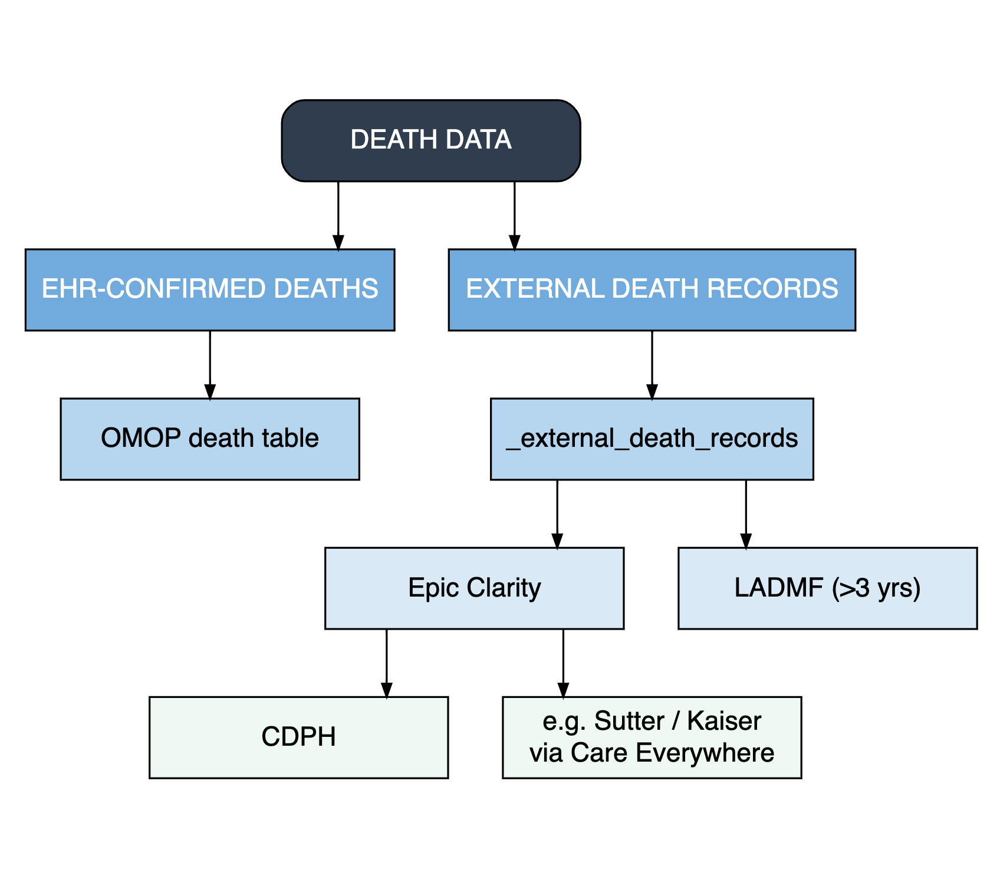

```{r setup, include=FALSE}
# Your existing initialization
rm(list=ls())
source("/workspaces/starr-oncology-data-lake-arpah/src/R/all_function.R", encoding = "UTF-8")
yaml_file_path <- "/workspaces/starr-oncology-data-lake-arpah/src/aug_2026/sql_params.yml"
```

```{r death sql, message=FALSE, warning=FALSE, results='hide'}
library(forcats)
library(dplyr)
library(tidyr)
library(DT)
library(plotly)
library(ggplot2)


# Define unified color palette
color_palette <- c('#8dd3c7', '#ffffb3', '#bebada', '#fb8072', '#b3de69', '#fcd7cd')

```
### External Death Source 

**Summary**:

In this release, death data were restructured to separate EHR-confirmed deaths from externally reported deaths. The standard OMOP death table now contains only deaths confirmed within the EHR (Epic), each with a valid, non-null death_date. All externally reported deaths were moved to a new companion table, `_external_death_records`, which stores one row per external death report per person, with the reporting source recorded on each record. 

The goal of this restructuring is to provide as much transparency as possible into the available death information for each patient, including the source of each reported death, while allowing downstream studies to determine how best to interpret and use these records based on their specific use case. This approach avoids imposing a single interpretation or hierarchy on externally reported death records, which may vary in source and confidence.

External death records are drawn from multiple sources:

- **Epic Clarity's external Death reports**, which contains data from:
    - `California’s Public Use Death File (CDPH)`: Death records are imported when a death date is not already available in the EHR (OMOP Death Table)
    - `External organization (e.g. Sutter, Kaiser, etc.)`: Death records received through Care Everywhere 
- **Social Security Limited Access Death Master File (LADMF)**: A dataset updated monthly in GCP. Death records occurring less than 3 years before the EHR pipeline data cut date are excluded (i.e. if the current EHR data is from 2026-07-19, then death dates more recent than 2023-07-19 are removed from the dataset). 


Please note that there could be multiple rows in _external_death_records per person since a person can have distinct reports from multiple sources (e.g., CDPH and LADMF both reporting a death, possibly with different dates), and even distinct reports from within a single source in a small number of cases. Any comparison against this table should aggregate or explicitly reason over this one-to-many structure rather than joining naively, as a direct join will fan out and inflate counts.




```{r death_source_overlap, message=FALSE, warning=FALSE, results='hide', include=FALSE}
# External death records only available in aug_2026
death_overlap_res <- fetch_data_from_sql_file(
  "/workspaces/starr-oncology-data-lake-arpah/src/sql_std/omop/ext_death/death_source_overlap.sql",
  yaml_file_path,
  release = "aug_2026"
)

death_counts_res <- fetch_data_from_sql_file(
  "/workspaces/starr-oncology-data-lake-arpah/src/sql_std/omop/ext_death/death_source_counts.sql",
  yaml_file_path,
  release = "aug_2026"
)
```

```{r death_source_summary_table, message=FALSE, warning=FALSE}
library(DT)
library(dplyr)

# Summary table: total + per-source counts
death_counts_table <- death_counts_res %>%
filter(death_source != "NeuralFrame death") %>%
  mutate(n_unique_patients = scales::comma(n_unique_patients)) %>%
  rename(
    "Death Source"     = death_source,
    "Unique Patients"  = n_unique_patients
  )

datatable(
  death_counts_table,
  caption = "Unique Patient Counts by Death Source (August 2026)",
  options = list(dom = 't', ordering = FALSE, pageLength = 10),
  rownames = FALSE
)
```

```{r death_source_overlap_table, message=FALSE, warning=FALSE, include = FALSE}
# Mutually exclusive combination counts from overlap query
overlap_combos <- death_overlap_res %>%
  filter(!death_source %in% c("OMOP death", "External death")) %>%
  arrange(desc(n_total)) %>%
  mutate(
    n_total    = scales::comma(n_total),
    pct        = paste0(pct_overlap_with_ext_death, "%")
  ) %>%
  select("Source Combination" = death_source,
         "Unique Patients"    = n_total,
         "% of Total"         = pct)

datatable(
  overlap_combos,
  caption = "Death Source Overlap Combinations (August 2026)",
  options = list(dom = 't', ordering = FALSE, pageLength = 10),
  rownames = FALSE
)
```

```{r death_source_bar_plot, message=FALSE, warning=FALSE}
library(plotly)
library(dplyr)

# Bar chart of per-source totals (exclude the combined total row)
bar_data <- death_counts_res %>%
  filter(death_source != "All death sources (combined)") %>%
  arrange(desc(n_unique_patients))

plot_ly(
  data = bar_data,
  x    = ~reorder(death_source, n_unique_patients),
  y    = ~n_unique_patients,
  type = 'bar',
  marker = list(color = c('#fb8072', '#8dd3c7', '#bebada')),
  text = ~paste0(death_source, "<br>Patients: ", scales::comma(n_unique_patients)),
  hoverinfo = "text"
) %>%
  layout(
    title  = "Unique Patients by Death Source (August 2026)",
    xaxis  = list(title = ""),
    yaxis  = list(title = "Unique Patients", tickformat = ","),
    showlegend = FALSE,
    margin = list(b = 80)
  )
```

### Mutually Exclusive External Death Source 

```{r death_ext_sources, message=FALSE, warning=FALSE, include=FALSE}
library(plotly)
library(dplyr)

# Fetch mutually exclusive patient counts by external death source combination
ext_death_exclusive_res <- fetch_data_from_sql_file(
  "/workspaces/starr-oncology-data-lake-arpah/src/sql_std/omop/ext_death/ext_death_person_exclusive.sql",
  yaml_file_path,
  release = "aug_2026"
)
```

```{r death_ext_sources_plot, message=FALSE, warning=FALSE}
library(plotly)
library(dplyr)
plot_ly(
  data = ext_death_exclusive_res,
  y    = ~reorder(source_combination, n_unique_patients),
  x    = ~n_unique_patients,
  type = "bar",
  marker = list(color = "#8dd3c7"),
  text = ~paste0(
    
    "<br> ", scales::comma(n_unique_patients),
    "<br>", pct_unique_patients, "%"
  ),
  hoverinfo = "text"
) %>%
  layout(
    title  = "Unique Patients by Mutually Exclusive External Death Source August",
    xaxis  = list(title = "Unique Pts", tickangle = -30),
    yaxis  = list(title = "", tickformat = ","),
    showlegend = FALSE,
    margin = list(b = 160)
  )
```


### Source Code
The source code for this page can be found [here](https://github.com/susom/starr-oncology-data-lake-arpah/tree/main/src/aug_2026/external_death_records.qmd), and the SQL queries that support these metrics can be found [here](https://github.com/susom/starr-oncology-data-lake-arpah/tree/main/src/sql_std/omop/ext_death).

