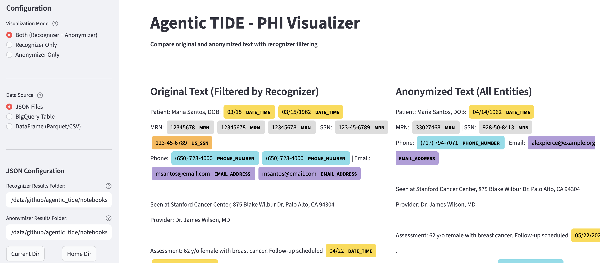

## Overview

This table summarizes comparative performance of three de-identification systems applied to a gold-standard corpus of clinical notes across multiple protected health information (PHI) categories. The evaluation dataset was constructed per our PHI labeling guidelines and process: notes were sampled using a random-plus-diversity strategy (modified set cover), pre-labeled by an LLM, reviewed by dual annotators, and adjudicated; only 100% agreement or adjudicated notes were retained as gold standard (see [Dataset Description](#dataset_for_evaluation)).

Systems include [TiDE 1.0](#tide10_summary), [Stanford AIMI v1](#stanford_aimi_v1_description), and [Tide 2.0 Alpha](#agentic_tide20_description). For each PHI category (e.g., DATE, PATIENT, ID, LOCATION, PHONE, WEB), we report precision and recall; the highest recall per row is highlighted in bold to emphasize sensitivity, which is typically prioritized in biomedical de-identification to minimize PHI leakage risk. Categories with extremely low performance indicate areas requiring methodological refinement or augmented knowledge sources.

| PHI Category                                        | TiDE 1.0* | Stanford AIMI v1 | Tide 2.0 Alpha** |
|:----------------------------------------------------|:----------|:-----------------|:-------------------------|
|                                                     | **Precision / Recall**  | **Precision / Recall**                                     | **Precision / Recall**   |
| DATE                                                | 0.76 / 0.69             | 0.94 / 0.84                                                | 0.94 / **0.97**          |
| PATIENT                                             | 0.21 / **0.76**         | 0.86 / 0.75                                                | 0.89 / 0.83              |
| PHONE                                               | 1.00 / 0.79             | 0.63 / 0.83                                                | 0.61 / **0.96**          |
| WEB                                                 | 1.00 / 0.57             | 0.00 / 0.00                                                | 0.66 / **0.82**          |
| DOCTOR                                              | 0.65 / **0.87**         | 0.45 / **0.87**                                            | 0.47 / **0.87**          |
| ID                                                  | 0.50 / 0.69             | 0.59 / **0.87**                                            | 0.60 / **0.87**          |
| LOCATION                                            | 0.55 / 0.62             | 0.14 / 0.75                                                | 0.15 / **0.78**          |

:  {.hover .responsive .sm}

\* Regex + Stanford CoreNLP 4.5.6 - no known PHI  

\** Stanford AIMI v1 + Regex + Known PHI

\*** Age and Hospital are not shown since the models were not trained for those categories. 

Across PHI categories, Tide 2.0 Alpha demonstrates the strongest recall in DATE (0.97), PHONE (0.96), WEB (0.82), and LOCATION (0.78), reflecting improved sensitivity in categories where lexical patterns and contextual cues benefit from hybrid approaches (modeling plus rule-based augmentation and known PHI lists). DATE performance is notably robust across all systems, but the alpha model’s recall edge suggests better coverage of diverse time expressions.

For patient-name related detection (PATIENT), TiDE 1.0 exhibits the highest recall (0.76), while the alpha system attains higher precision (0.89) with slightly lower recall (0.83), indicating a precision–recall trade-off that may be tuned depending on institutional risk tolerance and downstream use. Clinician-name (DOCTOR) and identifier (ID) categories show ties at the highest recall (0.87) across systems, suggesting that current methods are converging in sensitivity; precision differences may therefore drive practical selection depending on false positive tolerance.

Performance variability across categories highlights known challenges in biomedical de-identification. Categories with structured formats (e.g., dates, phone numbers, web URLs) benefit from deterministic pattern recognition, whereas unstructured entities (e.g., names, locations) require stronger contextual modeling and up-to-date dictionaries. The gains observed with Tide 2.0 Alpha are consistent with hybrid strategies that integrate learned representations, regular expressions, and curated PHI inventories. 

## Dataset used for evaluation {#dataset_for_evaluation}

We evaluated systems on a gold-standard labeled corpus of clinical notes developed via a structured process documented in the following internal reports:

- [PHI Labeling Guidelines:](../feb_2025/phi_labeling_guidelines.qmd) defines PHI categories, inclusion/exclusion criteria, and annotation rules with representative examples and edge-case guidance.
- [PHI Labeling Process:](../feb_2025/phi_labeling_process.qmd) details the sampling strategy (random plus diversity via a modified set-cover), pre-annotation with LLMs, dual-annotator workflow, and adjudication protocol.
- [PHI Labeling Report:](../feb_2025/phi_labeling_report.qmd) characterizes the labeled sample versus the broader STARR-OMOP corpus (age, sex, race, ethnicity, note types, length distributions) and summarizes PHI entity distributions.

The dataset comprises a stratified sample of clinical notes selected to maximize coverage of demographic and textual characteristics. Notes were pre-labeled by a large language model, then independently reviewed by two annotators following the published guidelines; disagreements were adjudicated and only 100% agreement or adjudicated notes were retained as gold standard. The corpus includes diverse PHI entity types (e.g., DATE, PATIENT, ID, LOCATION, PHONE, WEB), facilitating robust estimation of precision/recall across both structured and contextual categories. For full methodological details and population characteristics, see the referenced documents above.

## Stanford AIMI de-identifier model summary {#stanford_aimi_v2_description}

The Stanford AIMI de-identifier v2 ([stanford-deidentifier-v2](https://huggingface.co/StanfordAIMI/stanford-deidentifier-v2)) is a transformer-based token classification model fine-tuned on large-scale multi-institutional radiology corpora for PHI detection. This model is used as the primary transformer-based recognizer in Tide 2.0.

- **Architecture**: PubMedBERT-based encoder fine-tuned for token-level PHI classification. Inputs are chunked with overlap to handle long clinical documents while respecting the 512-token limit.
- **Training corpus**: Large annotated radiology corpora from Stanford University spanning multiple modalities—chest X-ray reports, chest CT reports, abdomen/pelvis CT reports, and brain MR reports—with validation on University of Pennsylvania datasets. The AGE category was added as a new PHI entity type in v2.
- **Performance**: Achieves F1 scores of 0.996 on Stanford test set and 0.973 on Penn external validation. On synthetic Penn reports, the model achieves F1 of 0.960, significantly outperforming commercial cloud vendor systems (F1 range: 0.632–0.754).
- **Key improvements over v1**: Added AGE category support, large-scale multimodal training for improved cross-institutional generalization, and enhanced robustness across different clinical text sources.
- **Model card**: Available on Hugging Face at [StanfordAIMI/stanford-deidentifier-v2](https://huggingface.co/StanfordAIMI/stanford-deidentifier-v2). Associated paper: [arXiv:2511.04079](https://arxiv.org/abs/2511.04079).

## TiDE 1.0 summary {#tide10_summary}

TiDE 1.0 (Text DEidentification) is an in-house, open-source clinical text de-identification pipeline designed for HIPAA Safe Harbor–oriented PHI scrubbing at large scale, while preserving note formatting for downstream NLP.

- Hybrid recognizers: CoreNLP-based NER (CRFClassifier) for names and locations (eg, street/city/state/ZIP), regex patterns and enumerated rules for structured identifiers (MRN, SSN, email, IP, URL, phone).
- Surrogate replacement (Hiding in Plain Sight): Detected PHI spans (eg, names, addresses, dates) are replaced with realistic synthetic surrogates built from public sources (eg, census, HRSA, FDA, SSA, CMS), making residual PHI harder to re-identify while maintaining usability.
- Sensitivity prioritized: The pipeline emphasizes recall to minimize PHI leakage; outputs are currently classified by Stanford UPO as High Risk due to small residual PHI risk, with DRA/Expert Determination used for additional mitigation when needed.
- Operational scale: Demonstrated throughput ≈100M notes in ~7 hours using distributed dataflow workers (~0.00025s/note).

## Detailed Description: Tide 2.0 Alpha {#agentic_tide20_description}

### Introduction

Clinical text de-identification requires both high recall—to minimize protected health information (PHI) leakage—and preservation of data utility for downstream research. Existing approaches present trade-offs: rule-based systems miss contextual patterns, machine learning models struggle with rare or institution-specific identifiers, and large language models (LLMs) introduce latency and cost at scale. Tide 2.0 addresses these limitations through a multi-strategy recognition architecture combined with **hidden-in-plain-sight anonymization**—producing de-identified text that preserves format, ensures consistency within and across patient records, and maintains longitudinal coherence for cohort studies and temporal analyses.

The system builds on TiDE 1.0's operational foundation while integrating transformer-based named entity recognition, LLM-augmented detection for complex patterns, and high-performance deterministic recognizers. Crucially, anonymization moves beyond simple redaction: identifiers are replaced with realistic surrogates that preserve structural characteristics (e.g., phone number format, name casing) while remaining cryptographically consistent per patient across all documents.

### Dataset

Tide 2.0 was evaluated on the same gold-standard corpus described in [Dataset Used for Evaluation](../feb_2025/phi_labeling_report.qmd). This corpus comprises clinical notes sampled via a random-plus-diversity strategy from STARR-OMOP, pre-labeled by an LLM, independently reviewed by dual annotators, and adjudicated to retain only 100% agreement or resolved notes. The evaluation spans structured PHI categories (DATE, PHONE, ID) and contextual categories (PATIENT, DOCTOR, LOCATION), enabling assessment of both pattern-based and semantic recognition capabilities.

### Methods

#### Multi-Strategy Entity Recognition

Tide 2.0 employs an ensemble of complementary recognition strategies, each targeting specific failure modes:

1. **Transformer-based NER**: The [Stanford AIMI de-identifier v2](#stanford_aimi_v2_description) model provides contextual detection of names, locations, dates, ages, and identifiers. The model uses chunking with overlap to handle long documents without truncation loss, achieving F1 scores of 0.996 on internal validation.

2. **LLM-Augmented Recognition**: For complex, ambiguous patterns—multi-format addresses, informal name mentions, embedded identifiers—structured JSON prompting elicits precise entity extraction from large language models. Multi-provider support (Google Vertex AI, OpenAI, Anthropic) enables flexibility across deployment contexts.

3. **High-Performance Pattern Recognizers**: Optimized regex-based recognizers detect structured PHI with significant speedups over baseline implementations: phone numbers (59× faster), URLs and IP addresses (35× faster), SSNs (10–20× faster), accession numbers (23× faster), and genetic sequences. These recognizers prioritize precision on well-defined formats.

4. **Patient-Specific Known Values**: An Aho-Corasick automaton enables O(n) multi-pattern matching against institutional identifier vaults, achieving 50–100× speedup over regex-based lookups. This captures patient-specific MRNs, names, addresses, and encounter identifiers with high confidence.

#### Hidden-in-Plain-Sight Anonymization

De-identified text should resemble authentic clinical notes—not redacted placeholders. Tide 2.0 implements privacy-preserving transformations that maintain data structure and enable longitudinal analysis:

1. **Format-Preserving Encryption (FPE)**: Using the FF3 algorithm, identifiers are transformed while retaining their original format. A phone number `(650) 723-4000` becomes `(408) 291-7823`, not `[PHONE]`. Transformations are deterministic: the same identifier consistently maps to the same surrogate.

2. **Longitudinal Consistency**: Per-patient cryptographic keys ensure that surrogates remain stable across all documents for an individual. This enables cohort construction, temporal trend analysis, and record linkage on de-identified data without re-identification risk.

3. **Semantic Replacement**: Names are replaced with realistic alternatives that preserve format and case (`SMITH, JOHN` → `CHEN, DAVID`). Date shifting uses HMAC-derived per-patient offsets (minimum ±3 days per HIPAA Safe Harbor) while preserving inter-event intervals within a patient's record.

#### Example: End-to-End De-identification

The following example demonstrates actual pipeline output on a synthetic clinical note, showing how multiple recognizers collaborate to detect PHI followed by format-preserving anonymization.

<!-- Entity highlight styles -->

**Legend:**

PERSON/PATIENT
HCW/DOCTOR
DATE
AGE
ID/MRN
SSN
PHONE
EMAIL
LOCATION
HOSPITAL
URL

**Original Text (with detected entities):**

Patient: Maria Santos, DOB: 03/15/1962
MRN: 12345678 | SSN: 123-45-6789
Phone: (650) 723-4000 | Email: msantos@email.com

Seen at Stanford Cancer Center, 875 Blake Wilbur Dr, Palo Alto, CA 94304
Provider: Dr. James Wilson, MD

Assessment: 62 y/o female with breast cancer. Maria reports mild fatigue.
Follow-up scheduled 04/22/2025.
Contact oncology coordinator Sarah at x4521 for questions.
Visit our portal at https://mychart.stanford.edu for results.

**Anonymized Output (with transformations):**

Patient: Elena Beegan, DOB: 04/14/1962
MRN: 33027468 | SSN: 928-50-8413
Phone: (717) 794-7071 | Email: sparksjennifer@example.net

Seen at 23915 Ugly Creek Trl, South Charleston Village, CA 98377
Provider: Dr. Kamauri Syrop, MD

Assessment: 62 y/o female with breast cancer. Elena reports mild fatigue.
Follow-up scheduled 05/22/2025.
Contact oncology coordinator Kaiden at 5jDOv for questions.
Visit our portal at https://fisher-diaz.com/ for results.

**Entity Transformation Summary:**
<table class="transform-table">
<tr><th>Original</th><th class="arrow">→</th><th>Anonymized</th><th>Type</th></tr>
<tr><td>Maria Santos</td><td class="arrow">→</td><td>Elena Beegan</td><td>PERSON</td></tr>
<tr><td>Maria</td><td class="arrow">→</td><td>Elena</td><td>PATIENT</td></tr>
<tr><td>03/15/1962</td><td class="arrow">→</td><td>04/14/1962</td><td>DATE</td></tr>
<tr><td>12345678</td><td class="arrow">→</td><td>33027468</td><td>MRN</td></tr>
<tr><td>123-45-6789</td><td class="arrow">→</td><td>928-50-8413</td><td>US_SSN</td></tr>
<tr><td>(650) 723-4000</td><td class="arrow">→</td><td>(717) 794-7071</td><td>PHONE</td></tr>
<tr><td>msantos@email.com</td><td class="arrow">→</td><td>sparksjennifer@example.net</td><td>EMAIL</td></tr>
<tr><td>875 Blake Wilbur Dr, Palo Alto, CA 94304</td><td class="arrow">→</td><td>23915 Ugly Creek Trl, South Charleston Village, CA 98377</td><td>LOCATION</td></tr>
<tr><td>Dr. James Wilson, MD</td><td class="arrow">→</td><td>Dr. Kamauri Syrop, MD</td><td>HCW</td></tr>
<tr><td>04/22/2025</td><td class="arrow">→</td><td>05/22/2025</td><td>DATE</td></tr>
<tr><td>Sarah</td><td class="arrow">→</td><td>Kaiden</td><td>HCW</td></tr>
<tr><td>x4521</td><td class="arrow">→</td><td>5jDOv</td><td>PHONE</td></tr>
<tr><td>https://mychart.stanford.edu</td><td class="arrow">→</td><td>https://fisher-diaz.com/</td><td>URL</td></tr>
</table>

**Key observations:**

- **Longitudinal name consistency**: Patient full name `Maria Santos` → `Elena Beegan` and first-name-only mention `Maria` → `Elena` are replaced with matching surrogates, ensuring consistency across all references to the same individual
- **Semantic name replacement**: Provider `James Wilson` → `Kamauri Syrop`, coordinator `Sarah` → `Kaiden` — all replaced with realistic alternatives preserving name structure
- **Format-preserving encryption**: Phone `(650) 723-4000` → `(717) 794-7071` retains format; MRN `12345678` → `33027468` maintains 8 digits; SSN `123-45-6789` → `928-50-8413` preserves XXX-XX-XXXX structure
- **Address anonymization**: Full address `875 Blake Wilbur Dr, Palo Alto, CA 94304` → `23915 Ugly Creek Trl, South Charleston Village, CA 98377` maintains US address format with realistic surrogate
- **Date shifting**: All dates shifted by the same patient-specific offset (+30 days): `03/15/1962` → `04/14/1962` and `04/22/2025` → `05/22/2025`, preserving temporal intervals
- **Multi-recognizer fusion**: Entities detected by multiple recognizers (Transformer NER + KnownValues + Pattern) with highest-confidence detection used for anonymization
- **Clinical utility**: The note remains readable and structurally identical to the original, supporting downstream NLP tasks

#### Interactive Visualizer

Tide includes a Streamlit-based visualization interface designed for quality control of the de-identification process. The visualizer enables reviewers to verify that PHI detection and anonymization are performing correctly, facilitating rapid identification of false negatives (missed PHI) or false positives (over-redaction) before data release.

Key quality control capabilities include:

- **Side-by-side comparison**: Original text with highlighted entities alongside the anonymized version, enabling rapid visual verification of transformations
- **Entity filtering**: Filter by recognizer type (Transformer, LLM, Pattern-based, KnownValues) or entity category to audit specific detection sources
- **Confidence scores**: Review detection confidence for each entity span to prioritize manual review of uncertain classifications
- **Multiple data sources**: Load results from JSON files, Parquet/CSV DataFrames, or BigQuery tables for batch quality assessment

### Future Directions

Ongoing development focuses on integration with agentic AI workflows. Planned capabilities include Model Context Protocol (MCP) support, enabling LLM-based agents to invoke de-identification as a tool within broader clinical data processing pipelines. This will facilitate real-time, context-aware anonymization in conversational and agentic applications.

### Results

| PHI Category                                        | OpenAI GPT-4 | gemini-2.5-flash | gemini-2.5-flash-lite | openai/gpt-oss-20b-maas | openai/gpt-oss-120b-maas |
|:----------------------------------------------------|:-------------|:-----------------------------------|:-----------------------------------------------|:------------------------------------------|:-------------------------------------------|
|                                                     | **Precision / Recall** | **Precision / Recall**            | **Precision / Recall**                         | **Precision / Recall**                     | **Precision / Recall**                      |
| AGE                                                 | 0.969 / 0.504| 0.797 / **0.896**                  | 0.789 / 0.875                                  | 0.878 / 0.820                              | 0.866 / 0.828                               |
| DATE                                                | 0.894 / **0.887**| 0.988 / **0.987**                  | 0.986 / 0.950                                  | 0.981 / 0.964                              | 0.983 / 0.942                               |
| DOCTOR                                              | 0.979 / 0.711| 0.948 / **0.967**                  | 0.950 / 0.921                                  | 0.950 / 0.856                              | 0.955 / 0.867                               |
| HOSPITAL                                            | 0.929 / 0.716| 0.585 / **0.854**                  | 0.650 / 0.812                                  | 0.682 / 0.713                              | 0.698 / 0.752                               |
| ID                                                  | 0.828 / 0.787| 0.915 / **0.946**                  | 0.962 / 0.883                                  | 0.925 / 0.867                              | 0.931 / 0.823                               |
| LOCATION                                            | 0.800 / **0.879**| 0.852 / 0.697                    | 0.826 / 0.683                                  | 0.735 / 0.701                              | 0.899 / 0.612                               |
| PATIENT                                             | 0.694 / 0.772| 0.954 / **0.943**                  | 0.927 / 0.894                                  | 0.892 / 0.833                              | 0.918 / 0.851                               |
| PHONE                                               | 0.969 / 0.831| 0.978 / **0.937**                  | 0.974 / **0.950**                              | 0.966 / 0.923                              | 0.980 / 0.921                               |
| WEB                                                 | 0.837 / **0.878**| 1.000 / 0.817                    | 1.000 / 0.780                                  | 0.985 / 0.817                              | 0.985 / 0.793                               |

:  {.hover .responsive .sm}

## References

- Stanford AIMI de-identifier v2: https://huggingface.co/StanfordAIMI/stanford-deidentifier-v2
- "Improving the Performance of Radiology Report De-identification with Large-Scale Training and Benchmarking Against Cloud Vendor Methods," arXiv 2024: https://arxiv.org/abs/2511.04079
- Stanford AIMI de-identifier v1: https://huggingface.co/StanfordAIMI/stanford-deidentifier-base
- "Automated deidentification of radiology reports combining transformer and 'hide in plain sight' rule-based methods," JAMIA 2022 (PMCID: PMC9846681): https://pmc.ncbi.nlm.nih.gov/articles/PMC9846681/
- TiDE clinical text Safe Harbor — https://starr.stanford.edu/methods/tide-clinical-text-safe-harbor